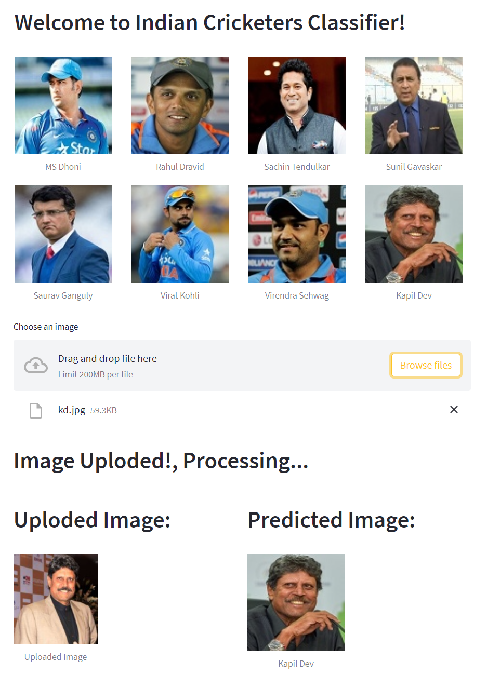

# Indian Cricketer Classifier:
This notebook is trying to bulia a model which will predict a Indian Cricketer based on the given image. In this project we have handelled 8 Indian Cricketers and bulild a model to classify the given image between this 8 Cricketers.  
#### The Indian Cricketrs are: 
        1. M.S. Dhoni
        2. Rahul Dravid
        3. Sachin Tendulkar
        4. Sunil Gavaskar
        5. Saurav Ganguly
        6. Virat Kohli
        7. Virendra Sehwag
        8. Kapil Dev
        
The dataset used has been scrapped from the internet, the dataset used is available in this repository.  
You can follow the analysis on   

## Deployment:
Streamlit is used to build a front-end of the web application for Indian Cricketer Classifier and is deployed on huggingface.co.

### Check the app:

